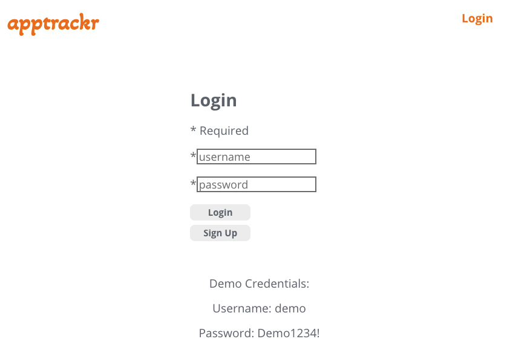
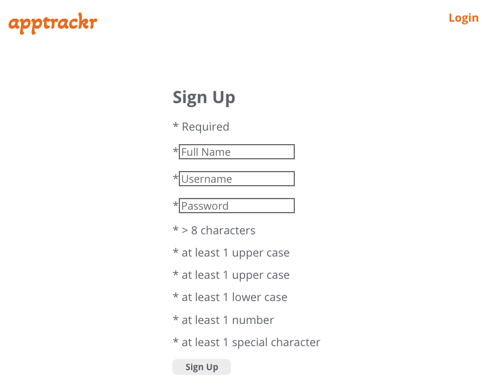
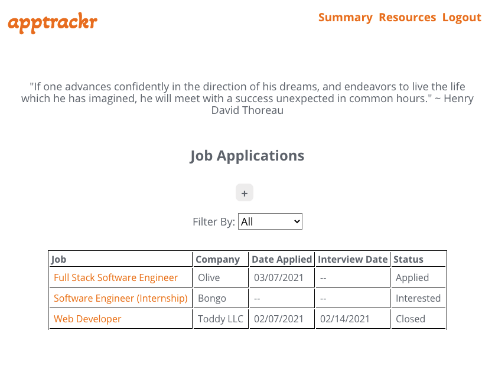
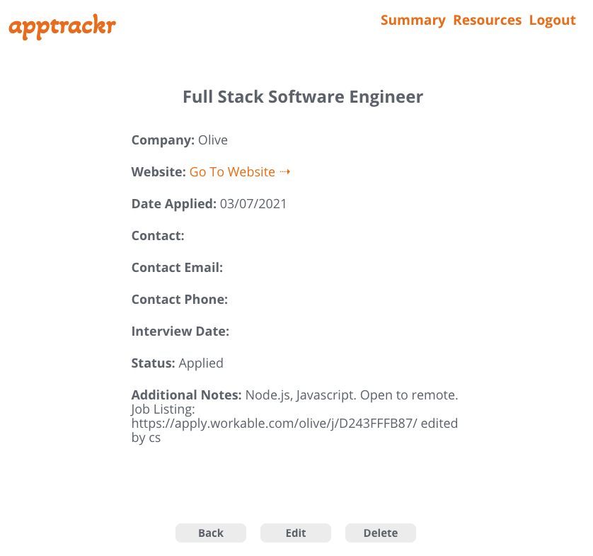
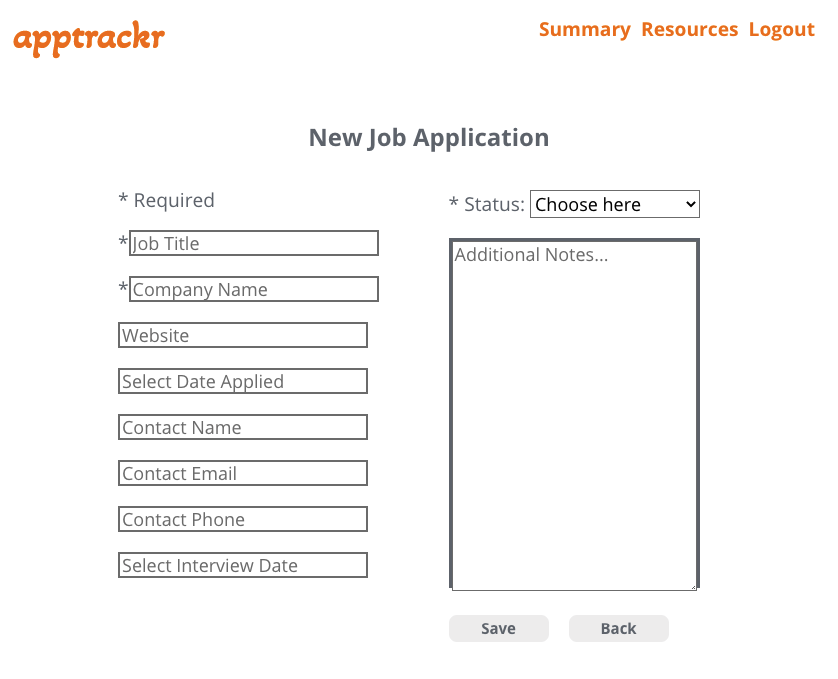
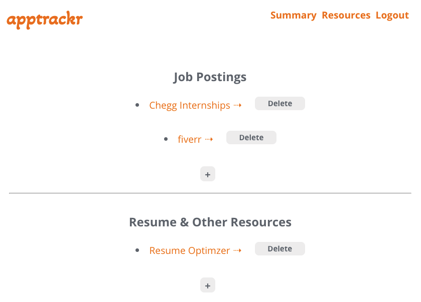
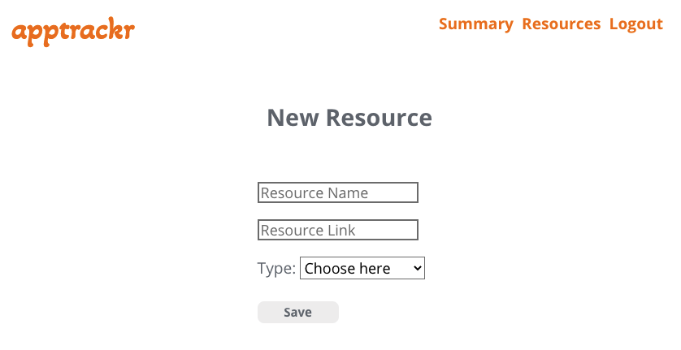

# apptrackr app

apptrackr is a responsive web application that allows users to keep track of their job applications and organize the process of a job search. This project was bootstrapped with [Create React App](https://github.com/facebook/create-react-app).

## Live Demo

Click [here](https://apptrackr-client.vercel.app/).

## Screenshots

### Login Page

### Sign Up Page

### Main Page

### Job Application Details Page

### Add / Edit Job Application Page

### Resources Page

### Add Resource Page

### Summary

This app allows users to easily keep track of their job applications. The app requires authentication so a user has to sign up for an account, or, if they would like to simply tour the app and get a feel for how it works, demo login credentials are provided on the Login page. Once logged in, a user can see all of their previously saved job applications, filter the applications by status, add and/or edit a job application, and view details of a previously saved job application. A user can also save links to their favorite job boards and other resources within the 'Resources' page, which allows for a more streamlined and efficient job search.

## Built With

* React
* CSS
* JavaScript

## Ideas for Future Features / Enhancements

- [ ] Utilize Ant Design UI Library for styling the table, buttons, date picker, resource list, icons, etc.
- [ ] Switch 'Filter' for table to be more user friendly
- [ ] Re-position 'Edit', 'Save', and 'Delete' buttons for an application item to be more user friendly
- [ ] Connect app with Gmail 
- [ ] Ability to export data to Google Sheets

